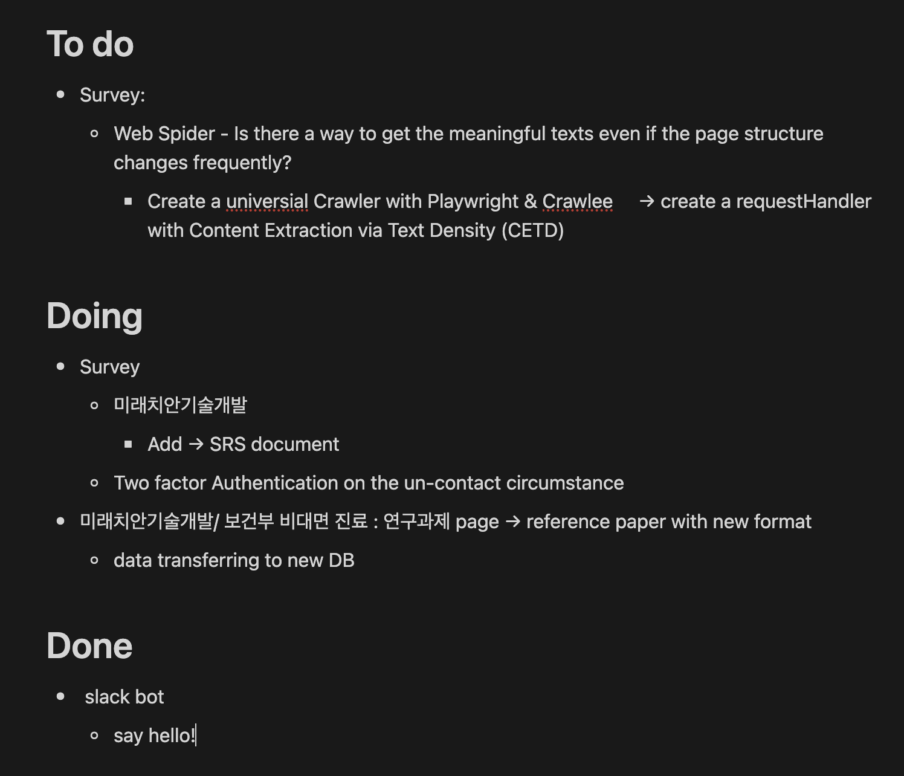

# ZIPIDA WORKTASK BOT

- 지피다봇은 워크태스크 등록 및 관리를 위한 봇으로, 사용 전 사용자 등록이 필요합니다.

- 사용자 등록은 /enroll 명령어, 워크태스크 작성은 /worktask 명령어, 최신화는 /reset 명령어로 진행합니다.
  - /reset는 선택사항으로, enroll시 자동 수행됩니다.
- 만약 슬랙 워크태스크 채널에 업데이트된 오늘의 워크태스크를 삭제하려면, /delete 명령어를 사용하세요.

- 워크태스크 문서는 #으로 시작하는 제목, 날짜 정보, 라벨, Todo/Doing/Done 블록 구조를 따라 작성해야 하며 비어있어서는 안됩니다.
- 인용구, 코드, 코드블록은 지원하지 않습니다.

올바른 작성 예시는 다음과 같습니다.

